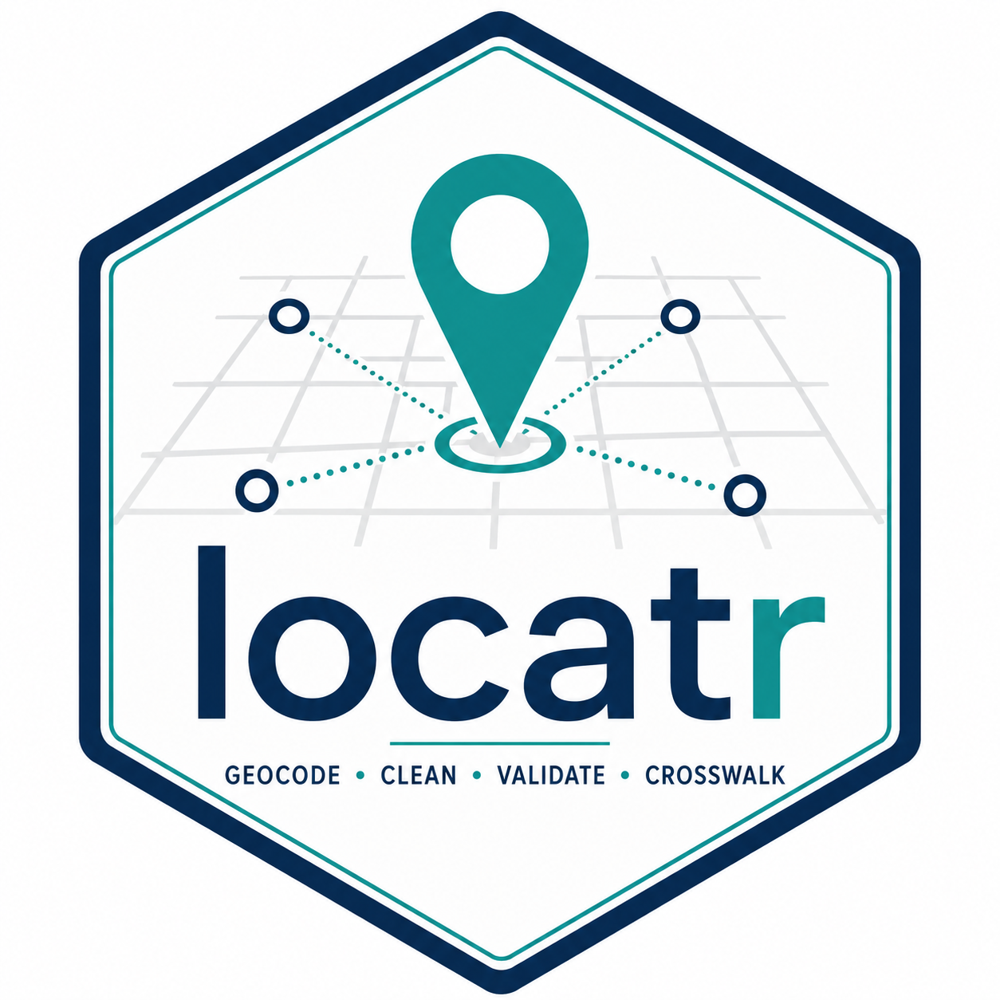

# locatr



[](https://github.com/PrigasG/locatr/actions/workflows/R-CMD-check.yaml)
[](https://github.com/PrigasG/locatr/actions/workflows/pkgdown.yaml)
[](https://prigasg.github.io/locatr/)

An audit-ready R toolkit for cleaning, geocoding, validating, reviewing, and
exporting messy address and location data. It sits **on top of** `tidygeocoder`:
`tidygeocoder` fetches coordinates; `locatr` decides whether those coordinates
are trustworthy and produces a dashboard-ready crosswalk.

## Why It Exists

Geocoders are imperfect. Strict services miss real addresses; fuzzy services can
confidently place a bad match far outside the intended service area. `locatr`
wraps that reality with three guards:

1. **Flagging** - PO boxes, placeholders, and missing fields never hit the
   geocoder.
2. **Fallback passes** - ArcGIS and name-based lookup can pick up what a stricter
   geocoder misses.
3. **Region validation** - anything that lands outside the configured bounding
   box or boundary polygon is rejected, not mapped.

Every function records an audit trail (`geocode_method`, `geocode_pass`,
`match_status`, `validation_status`, `review_status`, `manual_override_used`) so a
reviewer can see how each coordinate was produced. In finished geocoding output,
`review_status` uses outcome-oriented values such as `auto_accepted`,
`needs_manual_review`, `manual_override_applied`, and `rejected`.

## Install

```r
# from a local clone
devtools::document()
devtools::install()
```

## Workflow

```r
library(locatr)

cleaned <- records %>%
  clean_addresses(id = `Facility ID`, address = Address,
                  city = City, zip = Zip, name = `Facility Name`,
                  state = "NJ") %>%
  flag_bad_addresses()

geocoded <- geocode_records(cleaned, bbox = region_bbox("NJ"))

with_geography <- add_local_geography(geocoded, geography_shapes = my_local_shapes)

write_geocode_review(with_geography, "manual_review.csv")

final <- with_geography %>%
  apply_manual_overrides("manual_review_completed.csv", bbox = region_bbox("NJ")) %>%
  export_location_crosswalk("location_crosswalk.csv")
```

## No-code web app

For users who would rather not write R, the same pipeline is available as a
Shiny app: upload a CSV/Excel/Parquet file, geocode it, and download the
geocoded records immediately as CSV, Excel, or Parquet. If you also need
county/locality fields, attach geography from Census TIGER/Line or an uploaded
shapefile first, then download the geography crosswalk. The download step lets
you remove columns before exporting.

```r
install.packages(c("shiny", "bslib", "DT", "leaflet",
                   "readxl", "writexl", "arrow"))
run_locatr_app()
```

The app is also published as a Hugging Face Space (Docker):
<https://huggingface.co/spaces/Prigas89/locatr_reviewer>. The deployment
scaffolding lives in [`huggingface/`](huggingface/).

## The Geocoding Cascade

`geocode_records()` runs progressively fuzzier internet services, retrying only
rows that began with geocodable addresses and are still unplaced after each
validation pass:

| Tier | Function | Service | What it catches |
|------|----------|---------|-----------------|
| 0 | `backfill_from_reference()` | trusted table (no network) | records already verified in a prior cycle |
| 1 | `geocode_census()` | US Census (structured) | clean, in-range street addresses |
| 2 | `geocode_arcgis()` | ArcGIS (address line) | typos, range gaps, fuzzy streets |
| 3 | `geocode_by_name()` | ArcGIS (name + city) | named places, campuses, landmarks |
| manual | `apply_manual_overrides()` | human | the rest |

Tier 0 is optional and authoritative: pass
`geocode_records(cleaned, reference = verified)` or call
`backfill_from_reference()` directly to place records whose coordinates were
checked before. These rows are bbox-validated, stamped `pass_0_reference`, and
skipped by every later tier.

The input readiness value `ready_for_geocoding` is internal to the cascade; after
`geocode_records()` completes, valid matched rows are marked `auto_accepted`.

Name lookup is score-gated when the geocoder returns score/type fields. Precise
point-address hits above `min_score` pass cleanly; fuzzier POI, locality, or
low-score hits keep coordinates for reviewer context but remain in
`needs_manual_review`. The Shiny app exposes the name score threshold and the
address types that are allowed to pass without review.

## Regions And Geography

For geocoding, validation, and ArcGIS search extent, pass a bbox:

```r
custom_bbox <- c(lat_min = 38.0, lat_max = 39.0, lon_min = -77.5, lon_max = -76.0)
geocoded <- geocode_records(cleaned, bbox = custom_bbox)
```

For stricter validation, pass an `sf` boundary polygon with `boundary =`.

## Local Geography (NJ Municipalities)

In production, `location_locality` and `location_county` come from a spatial
join against an authoritative NJ municipal boundary layer, not from the geocoder
response or Census reverse-geocoding. The workflow is: load boundaries, derive a
bbox, geocode, validate, convert to `sf` points, spatially join to the polygons,
and write `location_county`, `location_locality`, `geography_match_status`.

```r
munis <- sf::st_read("path/to/Municipal_Boundaries_of_NJ.shp") %>%
  sf::st_make_valid() %>%
  dplyr::transmute(location_county = COUNTY, location_locality = MUN)

bbox <- bbox_from_sf(munis)
geocoded <- geocode_records(cleaned, bbox = bbox)

with_geography <- add_local_geography(
  geocoded,
  geography_shapes = munis,
  county_col   = "location_county",
  locality_col = "location_locality"
)
```

Or build the packaged default once with `data-raw/local_geography.R`, sourced
from [NJGIN/NJOGIS Municipal Boundaries of NJ](https://njogis-newjersey.opendata.arcgis.com/datasets/municipal-boundaries-of-nj-hosted-3424).

## Any State, With Census TIGER/Line

`build_local_geography()` pulls Census boundaries through `tigris` and
standardises them to the `location_county` / `location_locality` schema:

```r
areas <- build_local_geography(state = "PA", geography = "county_subdivision")
bbox <- bbox_from_sf(areas)

geocoded <- geocode_records(cleaned, bbox = bbox)

final <- add_local_geography(
  geocoded,
  geography_shapes = areas,
  county_col   = "location_county",
  locality_col = "location_locality"
)
```

Pick `geography` for the state: `county` is easy everywhere;
`county_subdivision` maps well to townships/municipalities in NJ, PA, NY, and
New England; `place` covers incorporated places/CDPs but misses townships and
many unincorporated areas; `tract` uses tract GEOIDs. For high-stakes,
state-specific reporting where "municipality" has legal meaning, use an
official state GIS layer and pass it directly.
